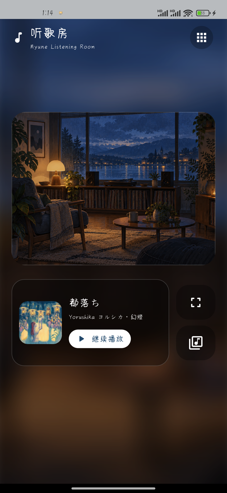

# Myune Music Android

一个专注于本地音乐的 Android 播放器，基于 [xiaobaimc/myune_music](https://github.com/xiaobaimc/myune_music) 制作。这里是独立的 Android Flutter 工程；Windows 和 Linux 版本请访问上游项目。

[下载 Android 预览版](https://github.com/liuheyang1/myune_music-android/releases/tag/v0.9.3-preview.1)

<p align="center"></p>

<p align="center"></p>

## 功能

- 从手机选择本地音乐，按歌曲、专辑和歌手浏览，管理歌单。
- 播放内嵌或本地歌词；可选择启用网络歌词。
- 在听歌房查看当前歌曲，进入横屏专注模式。
- 导出歌单 JSON 备份，并在重新选择原始音乐文件后按内容指纹恢复歌单。

应用不会附带音乐。导入时，选中的音频会复制到应用的持久目录；卸载应用会删除这些副本，请保留原始文件。歌单备份只包含歌单结构、文件名和内容指纹，不包含音频或手机上的绝对路径。

## 安装与已知限制

预览版提供签名的 ARM64 APK，最低支持 Android 7.0。包名为 `com.myune.music.preview`，可以与原包名的应用并存，但不会自动继承原应用的数据。换机恢复歌单仍需重新选择音乐文件。

当前发布 APK 已在小米 Mi 10 / Android 13 覆盖安装并显示主界面和专注模式；此前构建还验证了 FLAC 导入、播放、短时间后台播放及重启后歌曲保留。长时间后台播放、耳机和蓝牙中断、清除缓存及跨设备恢复仍待完整验收；细节见 [实机记录](docs/ANDROID_SMOKE_TEST.md)。

## 从源码构建

准备 Flutter 3.47.2、JDK 17、Android SDK/NDK 28.2.13676358 和 Rust 工具链。在项目根目录运行：

```powershell
flutter pub get
flutter analyze
flutter test test
flutter build apk --debug --target-platform android-arm64
```

GitHub Actions 在全新检出后执行分析、测试和 Android/Rust 调试构建。公开预览版使用单独的签名密钥；自行构建发行包的方法见 [发布脚本](tool/build_release.ps1) 和 [签名配置示例](android/key.properties.example)。真实密钥及密码应保存在仓库外。

## 来源与许可

本项目是 [xiaobaimc/myune_music](https://github.com/xiaobaimc/myune_music) 的 Fork，保留上游的 [Apache License 2.0](LICENSE)。Android 界面、导入流程和歌单备份包含后续修改。图标沿用上游资源；听歌房背景为本项目新生成的插画，详见 [素材来源](docs/ASSET_CREDITS.md)。第三方构建工具的许可保留在 `rust_builder/cargokit/`。

APK 未预置音乐或专辑封面。README 的实机截图展示了用户设备中已导入的歌曲；截图中的歌曲信息与专辑封面不适用本项目的 Apache-2.0 许可，权利归各自权利人。仓库和 APK 不包含从其他网站取得的场景图或 MiSans 字体文件。
